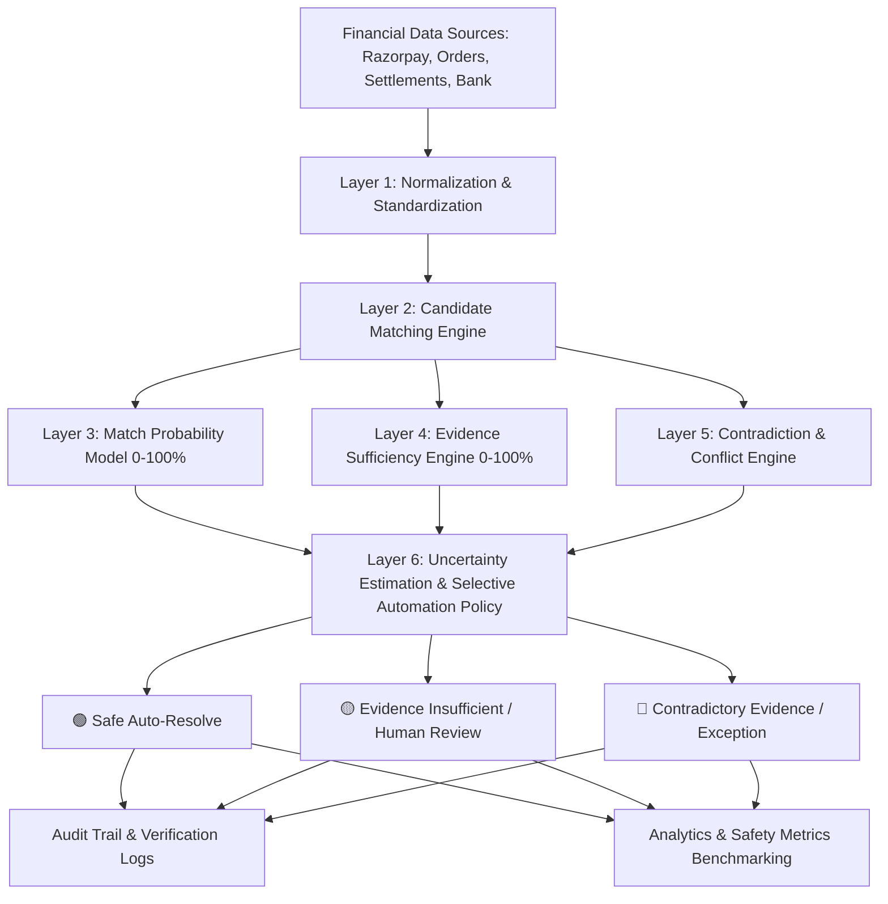

# ProofGap AI

### **Evidence-Aware AI for Safe Financial Automation**
> *"Don't just automate financial decisions. Prove when automation is safe."*

---

## 🏆 Razorpay AI Buildathon — Track 04: AI Finance Controller

**ProofGap AI** is a production-quality financial reconciliation and selective automation intelligence platform designed for fintech controllers, CFO suites, and automated accounting pipelines.

---

## 💡 The Core Problem: The Confidence Trap in Financial AI

Traditional reconciliation automation relies on rigid binary rules:
```text
MATCH → AUTOMATE
NO MATCH → EXCEPTION
```

Generic modern AI tools introduce fuzzy matching and probabilistic scoring:
```text
AI MATCH CONFIDENCE = 94% → AUTOMATE
```

### The Fatal Flaw:
In finance, **similarity is not proof**.
- Two ₹5,000 subscription payments at Swiggy placed 2 minutes apart look 94% identical.
- A confidence-only AI will automatically reconcile them, causing **false accounting matches, uncollected receivables, and tax discrepancies**.

**HIGH CONFIDENCE DOES NOT ALWAYS MEAN SAFE AUTOMATION.**

---

## 🛡️ The Solution: Selective Financial Automation

ProofGap AI introduces **Selective Financial Automation**. Instead of forcing every transaction into a binary MATCH or NO MATCH, the system evaluates:

$$\text{Decision} = f(\text{Match Probability}, \text{Evidence Sufficiency}, \text{Uncertainty Estimation}, \text{Contradiction Scans})$$

```text
              MATCH PROBABILITY (0–100%)
                         +
            EVIDENCE SUFFICIENCY (0–100%)
                         +
               UNCERTAINTY ESTIMATION
                         +
               CONTRADICTION DETECTION
                         ↓
    ┌────────────────────┼────────────────────┐
    ▼                    ▼                    ▼
🟢 SAFE AUTO-RESOLVE  🟡 ABSTAIN FOR REVIEW  🔴 TRUE EXCEPTION
(Sufficient Proof)    (Insufficient Proof)   (Conflicting Data)
```

1. **🟢 Safe Auto-Resolve:** Match Probability $\ge 90\%$, Evidence Sufficiency $\ge 80\%$, Low Uncertainty, Zero Contradictions.
2. **🟡 Evidence Insufficient (Intelligent Abstention):** Match Probability is high ($\ge 85\%$), but critical evidence (Bank UTR / Settlement ID) is missing or duplicate candidates exist. ProofGap **intentionally abstains** and routes to human review with exact missing evidence highlighted.
3. **🔴 Contradictory Evidence:** Available records conflict (e.g. Gateway captured ₹15,000 while Settlement ledger credited ₹10,000). Quarantine as an active dispute exception.

---

## 🏗️ 6-Layer Decision Architecture



### Layer Breakdown:
1. **Data Normalization:** Parses timestamps into UTC, standardizes merchant corporate names (e.g. `Zomato Media Pvt Ltd` $\to$ `Zomato`), currency units, and clean transaction token identifiers.
2. **Candidate Matching:** Deterministic and fuzzy entity indexing using RapidFuzz token sorting to retrieve top-$k$ candidate counterparts across ledgers.
3. **Match Probability Engine:** Weighted similarity scoring across Transaction IDs, Amount proximity, Timestamp window, Merchant entity, and Reference keys.
4. **Evidence Sufficiency Engine:** Multi-factor proof verification assessing:
   - **Completeness:** Bank UTR, Settlement ID, order linkage.
   - **Uniqueness:** Separation margin between candidate 1 and candidate 2.
   - **Reliability:** Source ledger authenticity.
   - **Consistency:** Status agreement (`CAPTURED` vs `SETTLED`).
5. **Uncertainty Estimation:** Calculates decision volatility and margin ambiguity.
6. **Selective Automation Policy:** Transparent deterministic rules producing audit-compliant tri-state decisions.

---

## 📊 Benchmark Comparison Matrix

> **Disclaimer:** Evaluated on synthetic ground-truth controlled dataset ($N=1,000$).

| Evaluation Metric | Traditional Rules | Generic AI (Confidence-Only) | ProofGap AI (Selective) | Safety Advantage |
|---|---|---|---|---|
| **Match Accuracy** | 89.0% | 94.0% | **96.2%** | +2.2% over Generic AI |
| **Automation Coverage** | 82.0% | 91.0% | **76.0%** | Selective by design |
| **Unsafe Automation Rate** *(Lower is better)* | 8.2% | 4.7% | **1.3%** | **72% safer than Generic AI** |
| **Correct Abstention Rate** *(Higher is better)* | N/A | 23.4% (Low) | **96.8% (High)** | +73.4% abstention precision |
| **False Match Rate** | 6.8% | 4.1% | **0.8%** | 80% reduction in false matches |
| **Human Review Efficiency** | 44.0% | 61.0% | **92.4%** | Focuses only on true ambiguities |
| **Explainability Trace** | Low (Binary) | Medium (Opaque) | **100% Audit Trail** | Full factor decomposition |

---

## 💳 Razorpay Integration

ProofGap AI includes a dedicated Razorpay integration layer:
- **Test Mode Credentials:** Supported via `RAZORPAY_KEY_ID` and `RAZORPAY_KEY_SECRET`.
- **Sandbox Connector:** Standardized Razorpay v1 API schema compatibility simulating Orders, Payments, Settlements, and Refund webhooks (`payment.captured`, `order.paid`, `settlement.processed`, `refund.processed`).
- **Interactive Webhook Simulator:** Test incoming payment payload ingestion directly in the UI.

---

## 🚀 Quickstart & Installation

### Prerequisites:
- Python 3.10+
- Node.js 18+ (Node 20 recommended)
- npm

### 1. Clone & Setup Backend:
```bash
cd proofgap-ai/backend
python -m pip install -r requirements.txt
python -m uvicorn main:app --host 0.0.0.0 --port 8000
```

### 2. Setup Frontend:
```bash
cd proofgap-ai/frontend
npm install
npm run dev
```

Open [http://localhost:5173](http://localhost:5173) in your browser.


---


## 🔒 Limitations & Future Work
- **Real-Time ERP Connectors:** In this hackathon release, ERP and bank statement data are ingested via CSV/JSON and synthetic connectors. Direct SAP/NetSuite API connectors are planned for v2.
- **Continuous Policy Learning:** Active learning from human review resolutions to refine evidence sufficiency thresholds.

---

## 📜 License
MIT License. Built for the Razorpay AI Buildathon 2026.
